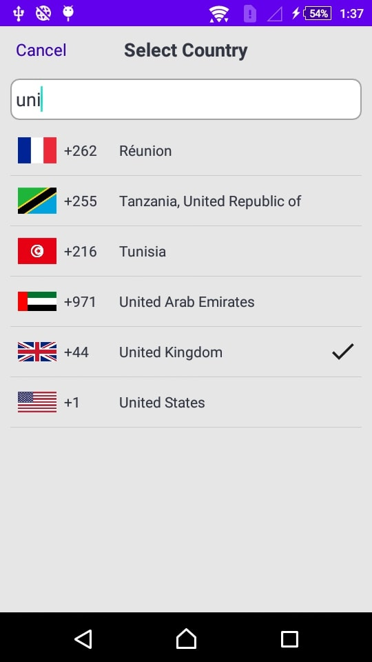

## Country Picker

Country Picker is a library that helps developers add a **"Country Picker Display"** in the Activity to their apps.

If the user need display Country List witht the icons as well as Country Dial Code.

## Country Picker

## Installation

How to

To get a Git project into your build:

Step 1. Add the JitPack repository to your build file 

Add it in your root build.gradle at the end of repositories:

	allprojects {
		repositories {
			...
			maven { url 'https://jitpack.io' }
		}
	}

Step 2. Add the dependency

	dependencies {
		implementation 'com.github.AppAspectTech:Country-Picker-Android:1.0.5'
	}

## Notes
The library is very simple, just note that :
* set Proper CountryCode("IN") or CountryPhoneCode("+91") or CountryName("India") for display that Country name selected.
* set Status Bar Color as per your theme.
* set Cancel text Color as per your theme.

## How to use

1. To use this library just add this snippet in the `onClick` of your fragment or activity.

Country Picker Example:

        
                    
                                 // Add as a startActivityForResult
                                Bundle bundle_data=new Bundle();
                                
                                            if(countryData_selected==null)
                                            {
                                
                                                bundle_data.putString(CountryConstants.ARGUMENT_COUNTRY_PHONE_CODE,edit_country.getText().toString().trim());   // for set the country phone code
                                
                                
                                                //"OR"
                                                //bundle_data.putString(CountryConstants.ARGUMENT_COUNTRY_CODE,edit_country.getText().toString().trim());       // for set the country code
                                
                                                //"OR"
                                                //bundle_data.putString(CountryConstants.ARGUMENT_COUNTRY_NAME,edit_country.getText().toString().trim());       // for set the country name
                                
                                
                                            }
                                            else
                                            {
                                                bundle_data.putString(CountryConstants.ARGUMENT_COUNTRY_PHONE_CODE,countryData_selected.getCountry_dial_code());        // for set the country phone code
                                
                              
                                                //"OR"
                                                //bundle_data.putString(CountryConstants.ARGUMENT_COUNTRY_CODE,countryData_selected.getCountry_code());                 // for set the country code
                                
                                                //"OR"
                                                //bundle_data.putString(CountryConstants.ARGUMENT_COUNTRY_NAME,countryData_selected.getCountry_name());                 // for set the country name
                                
                                            }

                                          //  // Black  Theme
                                          //  bundle_data.putInt(CountryConstants.ARGUMENT_STATUSBAR_COLOR,R.color.background_black_color);         // for set the status bar color as per theme
                                          //  bundle_data.putInt(CountryConstants.ARGUMENT_CANCEL_COLOR,R.color.text_color_white);                 // for set the cancel text color as per theme
                                         //   bundle_data.putInt(CountryConstants.ARGUMENT_HEADER_COLOR,R.color.text_color_white);                 // for set the Header text color as per theme
                                        //    bundle_data.putInt(CountryConstants.ARGUMENT_HEADER_BG_COLOR,R.color.background_black_color);        // for set the Header Background color as per theme
                                        //    bundle_data.putInt(CountryConstants.ARGUMENT_MAIN_BG_COLOR,R.color.background_black_color);          // for set the Main Background color as per theme
                                         //   bundle_data.putInt(CountryConstants.ARGUMENT_LIST_TEXT_COLOR,R.color.text_color_white);                  // for set the List text color as per theme
                                        //    bundle_data.putInt(CountryConstants.ARGUMENT_LIST_DIVIDER_COLOR,R.color.background_grey_dark_color);    // for set the List Divider color as per theme

                                            // White Theme
                                            bundle_data.putInt(CountryConstants.ARGUMENT_STATUSBAR_COLOR,R.color.colorPrimaryDark);         // for set the status bar color as per theme
                                            bundle_data.putInt(CountryConstants.ARGUMENT_CANCEL_COLOR,R.color.colorPrimary);                 // for set the cancel text color as per theme
                                            bundle_data.putInt(CountryConstants.ARGUMENT_HEADER_COLOR,R.color.text_color_black);                 // for set the Header text color as per theme
                                            bundle_data.putInt(CountryConstants.ARGUMENT_HEADER_BG_COLOR,R.color.background_white_color);        // for set the Header Background color as per theme
                                            bundle_data.putInt(CountryConstants.ARGUMENT_MAIN_BG_COLOR,R.color.background_white_color);          // for set the Main Background color as per theme
                                            bundle_data.putInt(CountryConstants.ARGUMENT_LIST_TEXT_COLOR,R.color.text_color_black);                  // for set the List text color as per theme
                                            bundle_data.putInt(CountryConstants.ARGUMENT_LIST_DIVIDER_COLOR,R.color.background_grey_light_color);    // for set the List Divider color as per theme

                                            Intent intent=new Intent(MainActivity.this, Country_Activity.class);
                                            intent.putExtras(bundle_data);
                                            startActivityForResult(intent, CountryConstants.SELECT_COUNTRY);
                                            
                            
2. To get the result form this library just add this snippet in your fragment or activity.

                        
        @Override
            protected void onActivityResult(int requestCode, int resultCode, Intent data)
            {
                super.onActivityResult(requestCode, resultCode, data);
                // check if the request code is same as what is passed  here it is 2
                if(resultCode== Activity.RESULT_OK)
                {
                    if(requestCode== CountryConstants.SELECT_COUNTRY)
                    {
                        if(data!=null)
                        {
                            Bundle bundle_data=data.getExtras();
                            if(bundle_data!=null)
                            {
                                String str_countryData=bundle_data.getString(CountryConstants.ARGUMENT_COUNTRY_DATA);
                                countryData_selected=  gson.fromJson(str_countryData,CountryData.class);
                                if(countryData_selected==null)
                                {
                                    edit_country.setText("");
                                }
                                else
                                {
                                    edit_country.setText(countryData_selected.getCountry_dial_code());      // for set the country phone code
        
        
                                    //"OR"
                                    //edit_country.setText(countryData_selected.getCountry_name());          // for set the country name
        
                                    //"OR"
                                    //edit_country.setText(countryData_selected.getCountry_code());     // for set the country code
        
        
                                }
        
                            }
        
                        }
        
                    }
                }
        
            }                      
                            
## Select Country Screen:

## Country List Screen:

## Country Picker Search Example:

## Selected Country Screen:

## Country Picker Selected Tick Example:

 
                                    
## Used by

If you use my library, please tell me at info@appaspect.com
So I can add your app here!

## License
Do what you want with this library.
